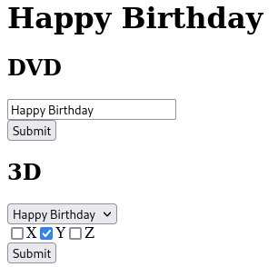

# ESP8266_OLED
Some birthday-flavoured fun with an ESP8266 and its OLED.
The ESP creates an Access Point (with SSID `Alles Gute zum Geburtstag` and password `12345678` by default).
The dashboard should be located at `192.168.4.1`.

## Modes

### DVD
Configurable text moving like the DVD logo.

### 3D
Some 3D shapes rotating.

